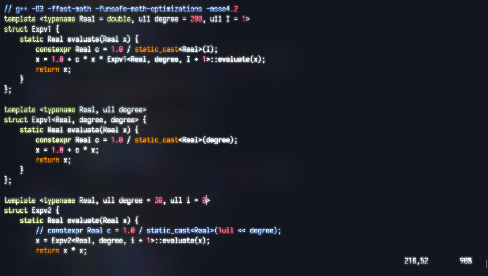

# Tuple 异质容器的实现



在 **Modern C++** 中，很多项目都有用到异质容器 `tuple`。有的项目用的直接就是 **C++** 标准库里的 `std::tuple`，有的项目可能会根据自己的需求重新实现一个。现在 `tuple` 实现方式一般分为两种，一种是 *递归继承 (Recursive Inheritance)*，另一种是 *多继承 (Multiple Inheritance)*，一般来说后者的性能可能会更好一些。本文会分别探讨这两种实现方式，最后会讲一下如何实现 **C++ 17** 中的 [结构化绑定声明](https://zh.cppreference.com/w/cpp/language/structured_binding)，如何获取 `tuple` 的元素也将在这块讲。由于不太想写 [SFINAE](https://zh.cppreference.com/w/cpp/language/sfinae) 所以我采用了 **C++ 20** 的 [概念与约束 (Constraints and Concepts)](https://zh.cppreference.com/w/cpp/language/constraints)，故所有代码都需要以 **C++ 20** 标准进行编译。

---

## 递归继承实现

递归式继承的 `tuple` 实现起来相对比较简单，像微软的 [Microsoft STL](https://github.com/microsoft/STL) 就是用该方式实现的，它的实现可以参考 [Here](https://github.com/microsoft/STL/blob/main/stl/inc/tuple)。递归式实现的 `tuple` 我将其命名为 `rtuple`。为了隐藏实现细节，用 `rtuple_impl` 来实现，`rtuple` 仅用于封装。对于一个 `rtuple<Type0, Type1, Type2>` 其继承关系大体如下所示

```cpp
struct rtuple<Type0, Type1, Type2>      : private rtuple_impl<Type0, Type1, Type2>;
struct rtuple_impl<Type0, Type1, Type2> : public rtuple_impl<Type1, Type2>;
struct rtuple_impl<Type1, Type2>        : public rtuple_impl<Type2>;
struct rtuple_impl<Type2>               : public rtuple_impl<>;
```

可以看到 `rtuple<int, char, double>` 继承自 `rtuple_impl<int, char, double>`，而 `rtuple_impl<int, char, double>` 又递归地继承自 `rtuple_impl<char, double>`、`rtuple_impl<double>`、`rtuple_impl<>`。数据便是保存在 `rtuple_impl` 之中，比如 `rtuple_impl<int, char, double>` 保存其第一个类型 `int` 的数据，`rtuple_impl<char, double>` 也是保存其第一个类型 `char` 的数据；而 `rtuple_impl<>` 不保存任何数据，仅用作于 [空基类优化](https://zh.cppreference.com/w/cpp/language/ebo)。

`rtuple` 的实现重点在于 `rtuple_impl`，首先需要声明 `rtuple_impl`

```cpp
template <typename... Types> struct rtuple_impl;
```

然后定义其递归基 `rtuple_impl<>`

```cpp
template <> struct rtuple_impl<> {
    constexpr rtuple_impl() noexcept  = default;
    constexpr ~rtuple_impl() noexcept = default;
};
```

看到这可能有人就要问了，为啥不用 `virtual dtor` ?
因为没这个必要！我们的 `rtuple_impl` 不是用作多态基类用途，加上了 `virtual` 只会使对象增加一个虚表指针 `vtpr` 占用更多的 **Bytes**。我们最终使用的是它的子类 `rtuple<...>` 而不是基类 `rtuple_impl<...>`，所以也不存在基类析构了而子类未析构的问题。

---

接下来便是定义 `rtuple_impl<...>` 的递归继承关系以及类成员。

递归关系非常好定义，比如有一个 `rtuple_impl<Types...>`，其类型序列 ( [形参包](https://zh.cppreference.com/w/cpp/language/parameter_pack) ) 为 `Types...` 可以分为第一个类型 `Head` 和余后的类型序列 `Tail...`。我们让`rtuple_impl<Types...>` 继承自 `rtuple_impl<Tail...>` 即可，

```cpp
template <typename Head, typename... Tail>
struct rtuple_impl<Head, Tail...> : public rtuple_impl<Tail...> { ... }
```

比如 `rtuple_impl<Type0, Type1, Type2>` 便可展开为

```cpp
struct rtuple_impl<Type0, Type1, Type2> : public rtuple_impl<Type1, Type2> { ... };
struct rtuple_impl<Type1, Type2>        : public rtuple_impl<Type2> { ... };
struct rtuple_impl<Type2>               : public rtuple_impl<> { ... };
```

由于 `rtuple_impl<>` 我们已经实现了，所以递归到这就会停下来。

---

再然后是定义 `rtuple_impl<...>` 的类成员，其中主要包含:

- 两个类型别名
  - `base_type` : 即基类类型 `rtuple_impl<Tail...>`
  - `value_type` : 即该类形参包 `Types...` 的第一个类型 `Head`，也是其数据成员的类型
- 数据成员 : `m_value`，类型为 `Head`
- 构造函数
- 默认析构函数

具体代码如下

```cpp
template <typename Head, typename... Tail>
struct rtuple_impl<Head, Tail...> : public rtuple_impl<Tail...> {
    using base_type  = rtuple_impl<Tail...>;
    using value_type = Head;

    value_type m_value;

    template <typename FirstValue, typename... OtherValues>
    requires std::is_nothrow_constructible_v<value_type, FirstValue>
    constexpr explicit rtuple_impl(FirstValue&& value, OtherValues&&... others) noexcept
        : base_type(std::forward<OtherValues>(others)...)
        , m_value(std::forward<FirstValue>(value))
    {}

    constexpr ~rtuple_impl() noexcept = default;
};
```

其中比较复杂的就只有构造函数了，它接受一个万能引用序列 `value, others...`，并将序列第一个值 `value` 用来构造类成员 `m_value`，其余的值序列 `other...` 通过 `std::forward` 转发给基类构造函数。
`requires` 是 **C++ 20** 的新关键词，具体用法请移步 [概念与约束 (Constraints and Concepts)](https://zh.cppreference.com/w/cpp/language/constraints)。`requires std::is_nothrow_constructible_v<value_type, FirstValue>` 这里是为了确保可以通过类型 `FirstValue` 来构造类型 `value_type` 而不会产生异常，即用 `value` 来构造 `m_value`，详见 [Here](https://zh.cppreference.com/w/cpp/types/is_constructible)。`value` 的类型不一定非要与 `m_value` 的一致，比如用 `double` 类型的值也可用来构造 `int` 类型的变量，尽管数值溢出可能会导致一些奇怪的错误。此处也可以用 [SFINAE](https://zh.cppreference.com/w/cpp/language/sfinae) 来实现，具体替代方法如下

```cpp
template <typename Head, typename... Tail>
struct rtuple_impl<Head, Tail...> : public rtuple_impl<Tail...> {
    ...
    template <typename FirstValue, typename... OtherValues,
              std::enable_if_t<std::is_nothrow_constructible_v<value_type, FirstValue>, int> = 0>
    constexpr explicit rtuple_impl(FirstValue&& value, OtherValues&&... others) noexcept
        : base_type(std::forward<OtherValues>(others)...)
        , m_value(std::forward<FirstValue>(value))
    {}

    constexpr ~rtuple_impl() noexcept = default;
};
```

显然还是用 `requires` 更简单明了。

---

最后便是用 `rtuple` 做一个简单的封装，隐藏掉 `rtuple_impl` 的实现细节，具体代码如下:

```cpp
template <typename... Types>
struct rtuple : private rtuple_impl<Types...> {
    using base_type = rtuple_impl<Types...>;

    template <typename... Values>
    requires (sizeof...(Values) == sizeof...(Types))
    constexpr explicit rtuple(Values&&... values) noexcept
        : base_type(std::forward<Values>(values)...)
    {}

    constexpr ~rtuple() noexcept = default;

    template <std::size_t Index, typename... ElemTypes>
    friend constexpr decltype(auto) get(rtuple<ElemTypes...>& tuple) noexcept;
};
```

显而易见，`rtuple` 并不直接保存数据，它的数据都都保存在了 `private` 继承的基类里面，构造函数将接收到的万能引用序列 `values...` 并转发给基类构造函数。这里的构造函数部分又用到了一个 `requires (sizeof...(Values) == sizeof...(Types))`，是为了保证 `rtuple` 的模板形参个数与构造函数模板形参个数相同，同样也可以用 [SFINAE](https://zh.cppreference.com/w/cpp/language/sfinae) 来实现。[`sizeof...()`](https://zh.cppreference.com/w/cpp/language/sizeof...) 是 **C++ 11** 中引入的用来在编译期获取形参包大小 ( 即形参个数 ) 的运算符。`rtuple` 的数据元素通过友元函数 `get` 进行访问，具体的 `get` 如何实现会在本文第三部分 [实现结构化绑定声明](##实现结构化绑定声明) 讲到。

---

## 多继承实现

多继承实现的 `tuple` 记为 `mtuple`，同样的也是由 `mtuple_impl` 来实现，但多了一个 `mtuple_value` 用来存储元素值。`mtuple` 的实现也有与 `rtuple` 相似的部分，我就不再重复了。`mtuple` 的继承关系比 `rtuple` 相对复杂那么一点，具体如下:

```cpp
struct mtuple<typename ... Types>
    : private mtuple_impl<std::make_index_sequence<sizeof...(Types)>, Types...>;

struct mtuple_impl<std::index_sequence<Indices...>, Types...>
    : public mtuple_value<Indices, Types>...;
```

这里的 `std::make_index_sequence<sizeof...(Types)>` 是为了生成一个 `std::index_sequence<Indices...>` 方便确定各个 `Type` 是处于形参包中的第几个位置 ( 位置从 0 开始 ) , 也方便后遍做形参包展开。以 `mtuple<Type0, Type1, Type2>` 为例，展开后如下:

```cpp
struct mtuple<Type0, Type1, Type2>
    : private mtuple_impl<std::make_index_sequence<3>, Type0, Type1, Type2>;

struct mtuple_impl<std::index_sequence<0, 1, 2>, Type0, Type1, Type2>
    : public mtuple_value<0, Type0>, mtuple_value<1, Type1>, mtuple_value<2, Type2>;
```

---

首先先来定义 `mtuple_value<std::size_t Index, typename Type>`，它的模板形参由两部组成，一个是索引 `Index`，另一个是存储的值的类型 `Type`。具体实现如下:

```cpp
template <std::size_t Index, typename Type>
struct mtuple_value {
    using value_type = Type;

    value_type m_value;

    template <typename ElemType>
    requires std::is_nothrow_constructible_v<value_type, ElemType>
    constexpr explicit mtuple_value(ElemType&& value) noexcept
        : m_value(std::forward<ElemType>(value))
    {}

    constexpr ~mtuple_value() noexcept = default;
};
```

构造函数接受一个万能引用 `value` 来初始化内部元素 `m_value`，这里也用到了 `requires std::is_nothrow_constructible_v<value_type, ElemType>` 来保证可以用类型 `ElemType` 来构造类型 `Type`。

---

`mtuple_impl` 实现起来也很简单

```cpp
template <typename, typename...>
struct mtuple_impl;

template <std::size_t... Indices, typename... Types>
struct mtuple_impl<std::index_sequence<Indices...>, Types...>
    : public mtuple_value<Indices, Types>...
{
    template <typename... Values>
    constexpr explicit mtuple_impl(Values&&... values) noexcept
        :  mtuple_value<Indices, Types>(std::forward<Values>(values))...
    {}
    constexpr ~mtuple_impl() noexcept = default;
};
```

其中继承部分 `mtuple_value<Indices, Types>...` 和构造函数的 [成员初始化器列表](https://zh.cppreference.com/w/cpp/language/constructor) `mtuple_value<Indices, Types>(std::forward<Values>(values))...` 部分都用到了 **C++ 17** 的 [折叠表达式](https://zh.cppreference.com/w/cpp/language/fold) 来展开形参包。实际上在 `rtuple` 和 `rtuple_impl` 中都不直接储存数据元素，而是在基类 `rtuple_value` 中储存。

---

接下来便是 `mtuple` 的实现了，与 `rtuple` 相比差别并不大，同样有友元函数 `get`，具体如下:

```cpp
template <typename... Types>
struct mtuple
    : private mtuple_impl<std::make_index_sequence<sizeof...(Types)>, Types...>
{
    using base_type = mtuple_impl<std::make_index_sequence<sizeof...(Types)>, Types...>;

    template <typename... Values>
    requires (sizeof...(Values) == sizeof...(Types))
    constexpr explicit mtuple(Values&&... values) noexcept
        : base_type(std::forward<Values>(values)...) {}

    constexpr ~mtuple() noexcept = default;

    template <std::size_t Index, typename... ElemTypes>
    friend constexpr decltype(auto) get(mtuple<ElemTypes...>& tuple) noexcept;
}; 
```

## 实现结构化绑定声明

**C++ 17** 中引入了 [结构化绑定声明](https://zh.cppreference.com/w/cpp/language/structured_binding) 这一新语法。具体用法示例如下:

```cpp
std::tuple<double, int, std::size_t> tp(1.0, 2, 3);
auto&& [d, i, s] = tp;
// 等价于以下代码
auto&& d = std::get<0>(tp);
auto&& i = std::get<1>(tp);
auto&& s = std::get<2>(tp);
```

结构化绑定声明类似于 **Python** 中的解包，上述示例中的 `d`、`i` 和 `s` 将会依次等于 `std::tuple` 类型变量 `tp` 中的第 0 个、第 1 个以及第 2 个元素。
某些 **STL** 容器的支持该语法，比如 `std::tuple`、`std::array`、`std::pair` 等等。对于一些简单的自定义类型可以直接使用结构化绑定声明，具体参考 [Here](https://zh.cppreference.com/w/cpp/language/structured_binding)。而另一些自定义类型，比如我们的 `rtuple` 和 `mtuple` 也想要实现结构化绑定的话，就得在 `namespace std` 下实现三个东西 `std::tuple_size`、`std::tuple_element` 和 `std::get` ( 其实这里实现成类成员函数 `xxx.get<Index>()` 也行 )，前边两个章节的没说的 `get` 便是留到这里讲的。在这我仅以 `mtuple` 的为例。

---

先来说说 `std::tuple_size`，这个是用来确定你的自定义类型中有多少个元素的，实现起来也简单，具体如下:

```cpp
namesapce std {

template <typename... Types>
struct tuple_size<mtuple<Types...>>
    : std::integral_constant<std::size_t, sizeof...(Types)>
{};

} // namespace std
```

我们的自定义类型 `mtuple` 内含多少个元素即为 `mtuple` 的模板实参有多少个，这个不难理解；但 `public` 继承自 ( 别问我这里为啥是 `public` ) `std::integral_constant<std::size_t, sizeof...(Types)>` 可能就有点难理解了。继承自它主要是为了获得这个类的静态成员 `std::size_t value`，这个 `value` 的值等于 `sizeof...(Types)` 即有多少个模板实参。`std::integral_constant` 的实现如下:

```cpp
template<class T, T v>
struct integral_constant {
    static constexpr T value = v;
    using value_type = T;
    using type = integral_constant; // 使用注入类名
    constexpr operator value_type() const noexcept { return value; }
    constexpr value_type operator()() const noexcept { return value; } // C++14 起
};
```

如果不想继承自这个类，还可以采用如下实现:

```cpp
namesapce std {

template <typename... Types>
struct tuple_size<mtuple<Types...>> {
    static constexpr std::size_t value = sizeof...(Types);
};

} // namespace std
```

---

接下来是略微复杂的 `std::tuple_element`，它的定义如下:

```cpp
template <std::size_t Index, typename... Types>
struct tuple_element<Index, mtuple<Types...>> {
    using type = ...
};
```

它所作的是就是获取 `Types...` 里第 `Index` 个类型，这里需要用一个辅助元函数 `mtuple_element` 来实现 ( 避免污染 `std` 命名空间 )，具体实现如下:

```cpp
template <std::size_t Index, typename... Types>
struct mtuple_element;

template <typename Head, typename... Tail>
struct mtuple_element<0, Head, Tail...> {
    using type = Head;
};

template <std::size_t Index, typename Head, typename... Tail>
requires (Index != 0)
struct mtuple_element<Index, Head, Tail...> {
    using type = typename mtuple_element<Index - 1, Tail...>::type;
};

template <std::size_t Index, typename... Types>
requires (Index < sizeof..(Types))
using mtuple_element_t = typename mtuple_element<Index, Types...>::type;

namespace std {

template <std::size_t Index, typename... Types>
struct tuple_element<Index, meta::mtuple<Types...>> {
    using type = mtuple_element_t<Index, Types...>;
};

} // namespace std
```

这段代码原理很简单，就是 `Index` 开始，每次消掉 `Types...` 的第一个类型并使 `Index` 减一，当 `Index == 0` 时 `Type...` 的第一个类型就是我们要找的那个。

---

接下来便是来讲 `get` 的实现。我们的 `rtuple` 并不直接保存数据，保存数据的是它的基类 `rtupple_value<Index, Type>`，故我们只需要将 `rtuple` 类型对象向上转型为基类类型 `rtupple_value<Index, Type>` 便可取出第 `Index` 个元素数据。获取第 `Index` 个基类类型我们用一个元函数 `rtuple_helper` 来实现，这里用到了之前的 `rtuple_element_t` 来获取第 `Index` 个类型。具体如下:

```cpp
template <std::size_t Index, typename ...Types>
requires (Index < sizeof...(Types))
struct mtuple_helper {
    using type = mtuple_value<Index, mtuple_element_t<Index, Types...>>;
};

template <std::size_t Index, typename... Types>
using mtuple_helper_t = typename mtuple_helper<Index, Types...>::type;
```

最后终于到 `get` 的实现了，不多说直接放代码:

```cpp
template <std::size_t Index, typename... ElemTypes>
constexpr decltype(auto) get(mtuple<ElemTypes...>& tuple) noexcept {
    using impl_type  = mtuple_helper_t<Index, ElemTypes...>;
    using value_type = mtuple_element_t<Index, ElemTypes...>;
    return (static_cast<impl_type&>(tuple).m_value);
}
```

原理之前便讲了，这里就只讲讲为什么返回值类型为 `decltype(auto)` 以及返回值为要用括号包起来。`decltype(auto)` 是为了让函数自动根据返回值来推断类型，如果只用 `auto` 的话它会直接忽略掉返回值的 `const`、`volatile` 以及引用性。返回值用括号包起来是为了确保 `decltype(auto)` 确保返回值会具有引用性。举个栗子：

```cpp
struct A { int val = 0; };
A a{};
decltype(a.val);   // 推断出的类型为 int
decltype((a.val)); // 推断出的类型为 int&

int x = 1;
decltype(x);   // 推断出的类型为 int
decltype((x)); // 推断出的类型为 int&
```

至此便可以对 `mtuple` 使用结构化绑定声明了，比如:

```cpp
int a = 2;
rtuple<int, int&, int&&> rt(1, a, 3);
auto [x, y, z] = rt;
```

对于 `rtuple` 也是类似的实现，这里不再赘述。

---

## Summary

实际上 `rtuple` 和 `mtuple` 都还只是个 *toy*，很多实际开发中会碰到的问题都还没考虑进去。比如我们的 `get` 就只针对于左值引用，`const` 引用以及右值引用等都还没考虑进去； `rtuple` 和 `mtuple` 的复制构造及移动构造也没考虑进去。但也足以演示 `tuple` 的基本实现原理了。

最后在这里附上 `rtuple` 和 `mtuple` 的完整代码:

- [rtuple](https://github.com/NagiSenbon/Meta/blob/main/include/tuple/recursive_inheritance_tuple.hpp)
- [mtuple](https://github.com/NagiSenbon/Meta/blob/main/include/tuple/multiple_inheritance_tuple.hpp)
